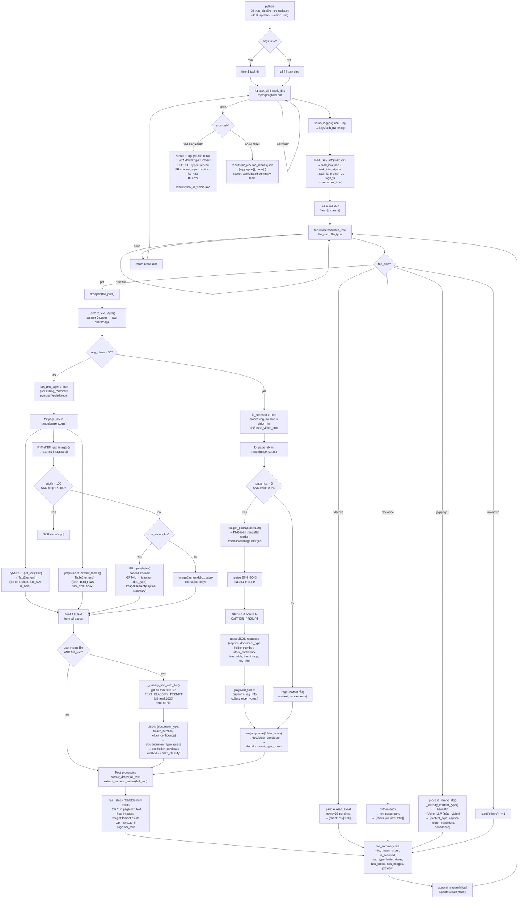

# Pipeline Workflow: `02_run_pipeline_on_tasks.py`

Tài liệu này mô tả chi tiết toàn bộ luồng xử lý của script `experiments/toan/02_run_pipeline_on_tasks.py`.

---

## 1. Tổng quan (Top-level)

```
python 02_run_pipeline_on_tasks.py [--task <prefix>] [--vision] [--log]

INPUT  : data/task_<uuid>/   (44 task dirs)
OUTPUT :
  --task mode : results/task_<id>.json hoặc task_<id>_vision.json
  all tasks   : results/02_pipeline_results.json
  --log       : logs/task_<full_name>.log (file + stdout)
  stdout      : summary / per-file detail
```

**2 chế độ chạy:**
- Không có `--task` → chạy tất cả 44 tasks, in aggregated summary
- Có `--task <prefix>` → chạy 1 task, in chi tiết từng file, lưu JSON riêng

**Flags:**
- `--vision` OFF (default): Scanned PDF → không call LLM, full_text rỗng
- `--vision` ON: Scanned PDF → GPT-4o Vision LLM; Text PDF → gpt-4o-mini text classify
- `--log`: ghi log chi tiết ra `experiments/toan/logs/<task_name>.log`

---

## 2. Luồng chi tiết — Plain Text

### Step 1: Parse CLI args
```
argparse → args.task, args.vision, args.log
```

### Step 2: Tìm task dirs
```
data/ → glob tất cả thư mục bắt đầu bằng "task_"
→ all_task_dirs[] sorted
→ filter nếu có --task prefix
```

### Step 3: Vòng lặp tasks — `for task_dir in tqdm(task_dirs)`

#### Step 3.1: `setup_logger(task_dir.name)` (nếu --log)
```
→ tạo Logger ghi cả file lẫn stdout
→ log_file: experiments/toan/logs/<task_name>.log
```

#### Step 3.2: `load_task_info(task_dir)`
```
INPUT : task_dir/task_info.json      (tiếng Nhật — prompt gốc)
        task_dir/task_info_vi.json   (tiếng Việt — prompt_vi, tags_vi)
OUTPUT: dict {
    task_id, prompt_vi, tags_vi,
    resource_count,
    resources_info: [
        {file_path, file_type, ...},
        ...
    ]
}
```

#### Step 3.3: `process_task(task_dir, use_vision_llm, logger)`

Khởi tạo `result` dict:
```python
result = {
    task_id, prompt_vi, tags_vi, resource_count,
    files: [],
    stats: {
        total_files, pdfs, xlsx, images, others,
        has_text, scanned, has_tables, has_images,
        total_chars, total_pages, total_processing_time, errors
    }
}
```

Vòng lặp `for res in resources_info`:

---

### Branch A: file_type == "pdf" → `process_pdf()`

#### A.1 Mở PDF
```
fitz.open(file_path) → fitz_doc
fitz_doc.page_count → doc.page_count
```

#### A.2 Detect text layer — `_detect_text_layer(fitz_doc)`
```
Sample 3 trang đầu
→ đếm tổng chars từ .get_text()
→ avg_chars = total / min(3, page_count)

avg_chars < 30  → is_scanned = True,  has_text_layer = False
avg_chars >= 30 → is_scanned = False, has_text_layer = True
```

---

#### A.3 — Nhánh SCANNED PDF

```
processing_method = "vision_llm"  (chỉ khi is_scanned AND use_vision_llm)
api_key = _load_api_key() (.env → OPENAI_KEY)

for page_idx in range(page_count):

    if page_idx < MAX_VISION_PAGES (= 3) AND use_vision_llm:
        ┌─ _process_scanned_page_vision(fitz_page, page_idx) ─┐
        │                                                       │
        │  fitz.Matrix(150/72, 150/72)                         │
        │  fitz_page.get_pixmap(matrix) → PNG toàn trang       │
        │    (text + bảng + ảnh merge thành 1 PNG flat)        │
        │  Image.frombytes("RGB", ...) → PIL Image             │
        │  img.thumbnail((2048, 2048)) → resize nếu quá lớn   │
        │  base64 encode → img_b64                             │
        │                                                       │
        │  GPT-4o Vision API (CAPTION_PROMPT) → raw JSON:      │
        │  {                                                    │
        │    "caption": "...",                                  │
        │    "document_type": "Test Report",                    │
        │    "key_info": ["2022/3/8", "K2CA-D", "6600V"],      │
        │    "folder_number": 7,                               │
        │    "folder_confidence": 0.90,                        │
        │    "has_table": true,                                │
        │    "has_image": false                                │
        │  }                                                    │
        │                                                       │
        │  page.ocr_text = caption + "\n" + key_info.join()   │
        │  collect: folder_votes[], folder_confidences[]        │
        │  set doc.document_type_guess (từ page đầu tiên)      │
        └───────────────────────────────────────────────────────┘

    else (page_idx >= 3 hoặc vision=OFF):
        PageContent rỗng (no text, no elements)

majority_vote(folder_votes) → doc.folder_candidate
avg(folder_confidences)     → doc.folder_confidence
```

**Output của Scanned branch:**
```
doc.full_text            = "\n\n".join(page.ocr_text for all pages)
doc.folder_candidate     = số folder (1-22, trừ 9 và 21)
doc.folder_confidence    = avg confidence
doc.document_type_guess  = "Test Report" / "Warranty" / ...
doc.is_scanned           = True
doc.processing_method    = "vision_llm"
```

---

#### A.4 — Nhánh TEXT PDF (has text layer)

```
processing_method = "pymupdf+pdfplumber"
plumber_doc = pdfplumber.open(file_path)
api_key = _load_api_key()

for page_idx in range(page_count):

    ── Step 1: Text via PyMuPDF ─────────────────────────────
    fitz_page.get_text("dict")["blocks"]
    → mỗi block → lines → spans
    → TextElement {
        content: str,
        bbox: BBox(x0, y0, x1, y1),
        font_size: float,
        is_bold: bool
      }

    ── Step 2: Tables via pdfplumber ────────────────────────
    plumber_page.extract_tables() → list of list[list[str]]
    plumber_page.find_tables()    → bbox của từng bảng
    → TableElement {
        content: raw text fallback,
        bbox: BBox,
        cells: [TableCell{row, col, value, is_header}],
        num_rows: int,
        num_cols: int
      }

    ── Step 3: Images via PyMuPDF ───────────────────────────
    fitz_page.get_images(full=True) → [(xref, ...)]
    for xref:
        fitz_doc.extract_image(xref) → {image_bytes, ext, width, height}

        if width < 100 AND height < 100: SKIP (icon/logo)

        if use_vision_llm:
            PIL.Image.open(image_bytes)
            resize to 2048×2048
            base64 encode
            GPT-4o Vision → JSON {caption, document_type}
            → ImageElement {
                bbox, image_index, image_path,
                width, height,
                caption,   ← từ Vision LLM
                summary    ← document_type từ Vision LLM
              }
        else:
            → ImageElement {bbox, image_index, image_path, width, height}
              (metadata only, không có caption)

page.elements = [TextElement, TableElement, ImageElement, ...]

── Step 4 (NEW): LLM Classify — _classify_text_with_llm() ──────
(chỉ chạy khi use_vision_llm=True và doc.full_text có nội dung)

    full_text[:1000] → gpt-4o-mini (TEXT_CLASSIFY_PROMPT)
    → JSON {
        "caption": "...",
        "document_type": "Table of Contents",
        "key_info": [...],
        "folder_number": 2,
        "folder_confidence": 0.92
      }
    → doc.document_type_guess = "Table of Contents"
    → doc.folder_candidate    = 2
    → doc.folder_confidence   = 0.92
    → processing_method += "+llm_classify"
```

**Output của Text branch:**
```
doc.full_text            = "\n\n".join(page.full_text for all pages)
    page.full_text       = TextElement.content + TableElement.to_markdown()
doc.is_scanned           = False
doc.processing_method    = "pymupdf+pdfplumber"                (vision=OFF)
                         = "pymupdf+pdfplumber+llm_classify"   (vision=ON)
doc.folder_candidate     = None (vision=OFF) | số folder (vision=ON)
doc.document_type_guess  = None (vision=OFF) | "Table of Contents" (vision=ON)
```

---

#### A.5 Post-processing PDF

```
INPUT: doc.full_text

extract_dates(full_text)
→ dates[] — regex tìm patterns: YYYY/MM/DD, 令和X年, 平成X年, ...

extract_numeric_values(full_text)
→ {category: [value, ...]} — kV, kW, MΩ, A, ...

has_tables detection:
→ any TableElement in page.elements  (text PDF)
   OR "|" in page.ocr_text           (scanned PDF — Markdown table syntax)

has_images detection:
→ any ImageElement in page.elements  (text PDF)
   OR "[IMAGE:" in page.ocr_text     (scanned PDF)

→ file_summary dict (append vào result["files"])
→ update result["stats"]
```

---

### Branch B: file_type in ("xlsx", "xls")

```
pandas.read_excel(file_path, sheet_name=None, nrows=10)
→ {sheet_name: DataFrame}
→ file_summary {file, type="xlsx", sheets[], preview{sheet: csv[:200]}}
stats["xlsx"] += 1
```

---

### Branch C: file_type in ("docx", "doc")

```
python-docx Document(file_path)
→ "\n".join(paragraph.text for paragraphs)
→ file_summary {file, type, chars, text_preview[:200]}
stats["others"] += 1
```

---

### Branch D: file_type in IMAGE_EXTENSIONS (jpg/png/tiff/...)

```
process_image_file(file_path, task_id, use_vision_llm)

    PIL.Image.open(file_path)
    _classify_content_type(img):
        → heuristic dựa trên pixel std/mean:
           std < 40 & mean > 200 → TABLE_SCAN
           std < 60              → TECHNICAL_DRAWING
           avg_color_std > 60   → PHOTO
           else                  → MIXED

    if use_vision_llm:
        img.thumbnail((2048, 2048))
        base64 encode
        GPT-4o Vision (CAPTION_PROMPT) → JSON
        → doc.image_caption, document_type_guess,
          folder_candidate, folder_confidence, full_text

→ file_summary {
    file, type, content_type,
    document_type, folder_candidate, folder_confidence,
    caption, text_preview, processing_time_sec
  }
stats["images"] += 1
```

---

### Branch E: file_type unknown

```
stats["others"] += 1
(không xử lý)
```

---

### Step 4: Aggregate stats (chạy all tasks)

```
aggregate = defaultdict(int)
for each task result:
    aggregate["total_files"] += stats["total_files"]
    aggregate["pdfs"]        += stats["pdfs"]
    aggregate["has_text"]    += stats["has_text"]
    aggregate["scanned"]     += stats["scanned"]
    aggregate["has_tables"]  += stats["has_tables"]
    aggregate["has_images"]  += stats["has_images"]
    aggregate["total_chars"] += stats["total_chars"]
    aggregate["total_pages"] += stats["total_pages"]
    aggregate["total_time"]  += stats["total_processing_time"]
    aggregate["errors"]      += stats["errors"]
```

---

### Step 5: Output

**Nếu --task (single task):**
```
stdout + log: per-file detail
  📄 <name> [SCANNED] p=7 chars=536
       type=Approval Document | folder=4 (0.90) | tables=False images=False
       dates=['22年5月30日', ...]
       preview: ...
  📄 <name> [TEXT  ] p=2 chars=792
       type=Table of Contents | folder=2 (0.92) | tables=False images=False
  🖼️  <name> content_type=technical_drawing | type=... | folder=?
  📊  <name> [xlsx]
  ❌  <name> — error message

results/task_<id>.json           (vision=OFF)
results/task_<id>_vision.json    (vision=ON)
logs/task_<full_name>.log        (nếu --log)
```

**Nếu all tasks:**
```
stdout: aggregated summary + per-task table
results/02_pipeline_results.json:
  {
    "aggregate": {...},
    "tasks": [
      {task_id, prompt_vi, tags_vi, files[], stats{}},
      ...
    ]
  }
```

---

## 3. Mermaid Diagram — Full Pipeline



---

## 4. LLM Cost Summary

| File type | LLM model | Khi nào gọi | Chi phí ước tính |
|---|---|---|---|
| Scanned PDF | GPT-4o Vision | `--vision`, tối đa 3 trang đầu | ~$0.006/page × 3 = ~$0.018/file |
| Text PDF | gpt-4o-mini (text) | `--vision`, full_text không rỗng | ~$0.001/file |
| Image file | GPT-4o Vision | `--vision` | ~$0.006/file |
| Embedded image in text PDF | GPT-4o Vision | `--vision`, size ≥ 100×100px | ~$0.006/image |

---

## 5. Data Flow — Input → Output

```
data/task_<uuid>/
├── task_info.json          → task_id, resources_info[]
├── task_info_vi.json       → prompt_vi, tags_vi
└── Public/
    └── VPP.../
        ├── file.pdf (scanned)   → ProcessedDocument {
        │                             full_text (từ Vision LLM OCR),
        │                             folder_candidate, document_type_guess,
        │                             folder_confidence,
        │                             pages[{ocr_text}],
        │                             processing_method="vision_llm"
        │                           }
        ├── file.pdf (text)      → ProcessedDocument {
        │                             full_text (từ PyMuPDF),
        │                             pages[{TextElement[], TableElement[], ImageElement[]}],
        │                             folder_candidate  (nếu --vision → gpt-4o-mini),
        │                             document_type_guess (nếu --vision),
        │                             processing_method="pymupdf+pdfplumber[+llm_classify]"
        │                           }
        ├── file.xlsx            → {sheets[], preview{}}
        ├── file.jpg             → ProcessedDocument {
        │                             content_type, image_caption,
        │                             folder_candidate (nếu --vision)
        │                           }
        └── file.doc             → {chars, text_preview}

                    ↓ post-processing

file_summary {
    file, type, pages, chars,
    is_scanned, has_text,
    document_type, folder_candidate, folder_confidence,
    has_tables, has_images,
    dates_found[], numeric_values{},
    text_preview,
    processing_time_sec
}

                    ↓

results/task_<id>_vision.json   (single task)
results/02_pipeline_results.json (all tasks)
logs/task_<name>.log             (nếu --log)
```

---

## 6. Giới hạn hiện tại

| Vấn đề | Mô tả |
|---|---|
| MAX_VISION_PAGES = 3 | Scanned PDF nhiều trang → chỉ 3 trang đầu được Vision LLM phân tích |
| Text PDF folder (vision=OFF) | Không gọi LLM → `folder_candidate = None` |
| Image in text PDF (vision=OFF) | ImageElement chỉ có bbox/size, không có caption |
| .doc files | `python-docx` không đọc được `.doc` (chỉ `.docx`), thường báo lỗi |
| per-page detail | `file_summary` chỉ lưu aggregate — không có chi tiết từng page trong output JSON |
